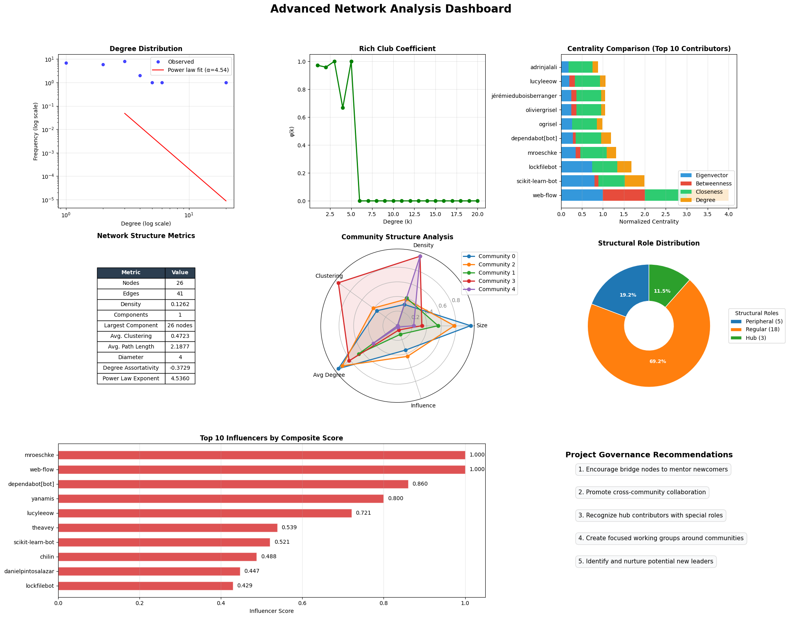
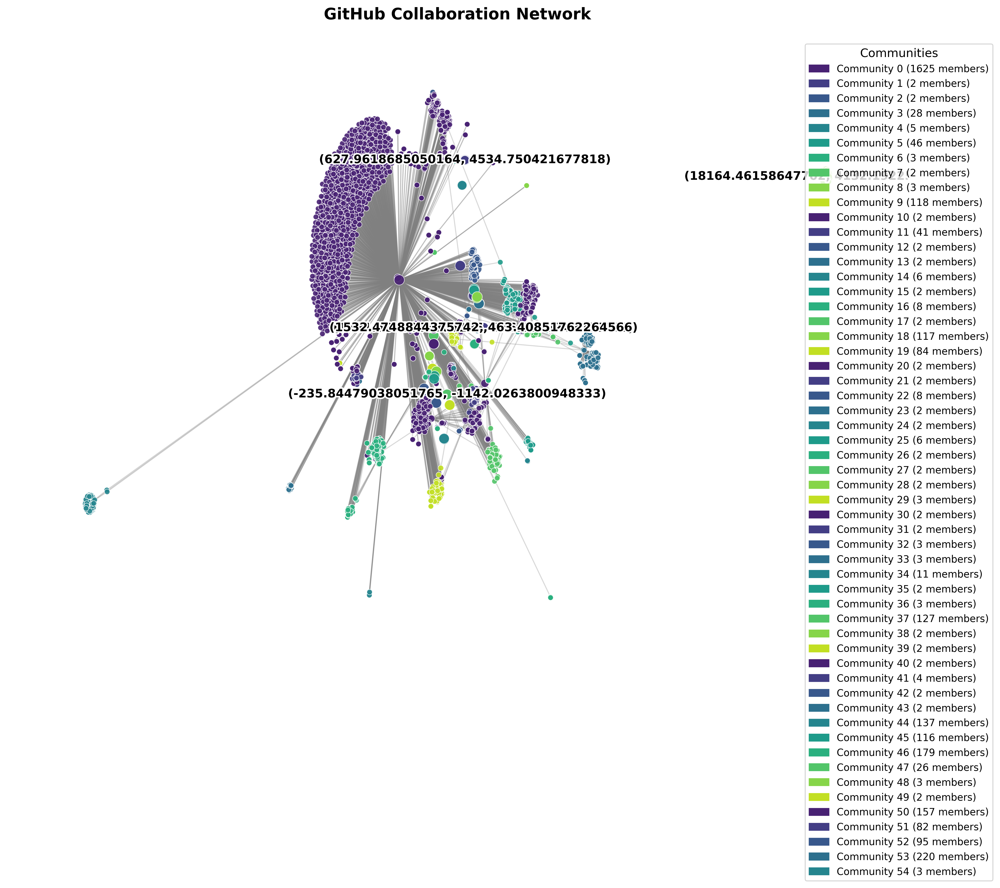
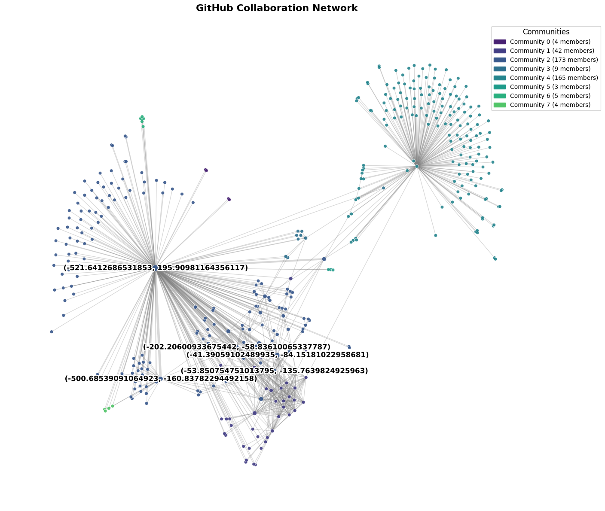
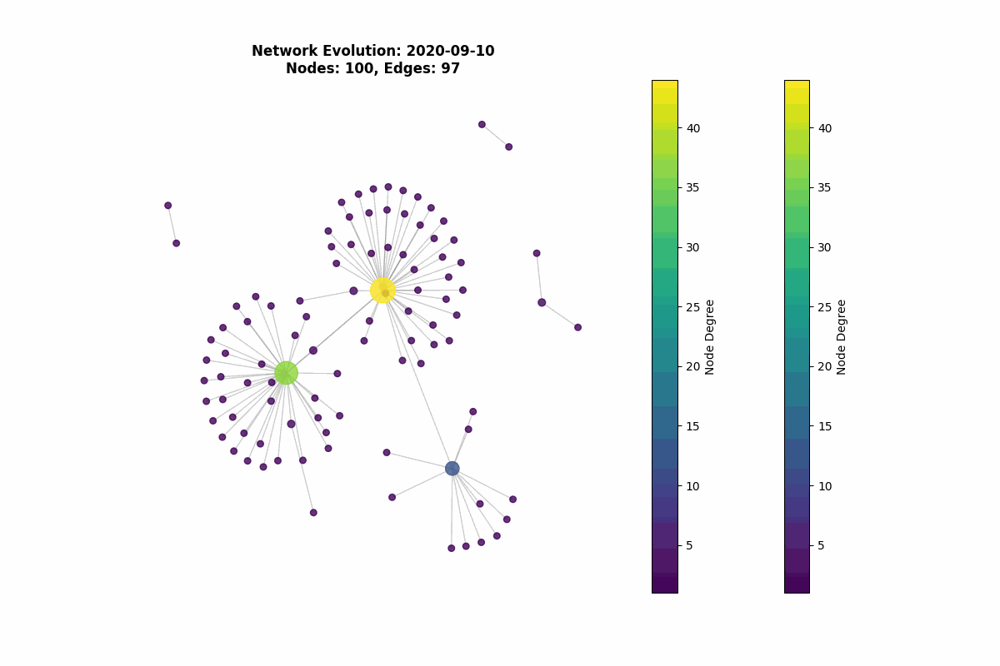

# CollabNetVisor

*A Data-Driven Network Science Toolkit for Analyzing Open-Source Collaboration*

---

 

## Overview

**CollabNetVisor** is a research-grade analytics pipeline that explores, quantifies, and visualizes the collaborative dynamics of open-source software (OSS) communities, focusing on platforms like GitHub. By leveraging advanced network science and temporal analysis, CollabNetVisor unveils hidden structures, influential contributors, and evolutionary patterns within OSS networks, enabling maintainers and researchers to make data-driven decisions for sustainable growth and governance.

---

## ✨ Key Features

* **End-to-End Data Pipeline:** Automated ingestion and preprocessing of real-world GitHub collaboration data (commits, PRs, issues, users).
* **Network Science Analytics:** Calculates degree distributions, clustering, centrality measures, modularity, and more.
* **Community Detection:** Uncovers cohesive subgroups via state-of-the-art algorithms (Louvain, Infomap, Spectral Clustering).
* **Influence Mapping:** Identifies top contributors using multi-faceted centrality rankings (degree, betweenness, PageRank).
* **Temporal Evolution:** Tracks how communities and influence evolve over time (split/merge, role shifts, major events).
* **Actionable Insights:** Produces governance recommendations to foster healthy and innovative OSS communities.
* **Rich Visualizations:** Generates publication-ready plots for network structures, community maps, influencer rankings, and time-series analysis.

---

## 🚀 Project Motivation

Open-source projects are the backbone of global digital infrastructure, yet their internal collaboration and governance remain mysterious and complex. This project bridges that gap—offering a transparent, empirical, and visually intuitive exploration of OSS network dynamics.

---

## 📊 Example Visualizations

| Collaboration Network Overview   | Community Detection (Louvain)       | Temporal Community Evolution       |
| -------------------------------- | ----------------------------------- | ---------------------------------- |
|  |  |  |


---

## 🧑‍💻 Methodology

### 1. Data Acquisition & Preprocessing

* Retrieve collaboration data via [GitHub API](https://docs.github.com/en/rest), [GHTorrent](http://ghtorrent.org/), or [Kaggle](https://www.kaggle.com/datasets?search=github).
* Normalize user identities, handle alias merges, and enrich with metadata (location, org, etc).

### 2. Exploratory Network Analysis

* Compute statistics: degree distribution, clustering coefficient, path lengths.
* Confirm scale-free/small-world properties via visualization.

### 3. Community Detection & Influence Mapping

* Run multiple algorithms (Louvain, Infomap, Spectral) for robust community partitioning.
* Rank contributors with advanced centrality (degree, betweenness, eigenvector, PageRank).

### 4. Temporal Evolution

* Track network changes across weekly/monthly snapshots.
* Analyze community dynamics: merges, splits, and influencer role changes.

### 5. Result Synthesis & Recommendations

* Summarize findings as actionable strategies for OSS project governance and contributor onboarding.

---

## 📈 How to Include Your Own Plots

1. **Export from Jupyter/Colab:**
   Save your key plots as `.png`/`.jpg` using:

   ```python
   plt.savefig("images/your_plot_name.png", dpi=300)
   ```
2. **Add to `images/` Folder:**
   Place all exported figures into an `images/` folder in the repo root.
3. **Embed in README:**
   Use Markdown:

   ```markdown
   
   ```

---

## 📂 Repository Structure

```
.
├── main.ipynb               # Core analysis notebook
├── images/                  # Folder for all output plots and figures
├── data/                    # Raw and cleaned datasets (not pushed if large)
├── src/                     # Utility scripts (data processing, visualization, analysis)
├── README.md                # This file
```

---


## 🏁 Usage

1. **Clone the Repository:**

   ```bash
   git clone https://github.com/your-username/CollabNetVisor.git
   cd CollabNetVisor
   ```
2. **Install Dependencies**
3. **Run the Notebook:**
   Open `main.ipynb` in Jupyter/Colab and execute all cells.

---

## 📚 References & Data Sources

* [GHTorrent](http://ghtorrent.org/)
* [GitHub Archive](http://www.gharchive.org/)
* [Kaggle GitHub Datasets](https://www.kaggle.com/datasets?search=github)
* Barabási, Newman, Fortunato (Network Science literature)
* [NetworkX Documentation](https://networkx.org/)

---


## 🙌 Acknowledgements

This project was developed as part of a network science course at \IIIT Delhi. Collaborators \@KanishkGoell.

---
